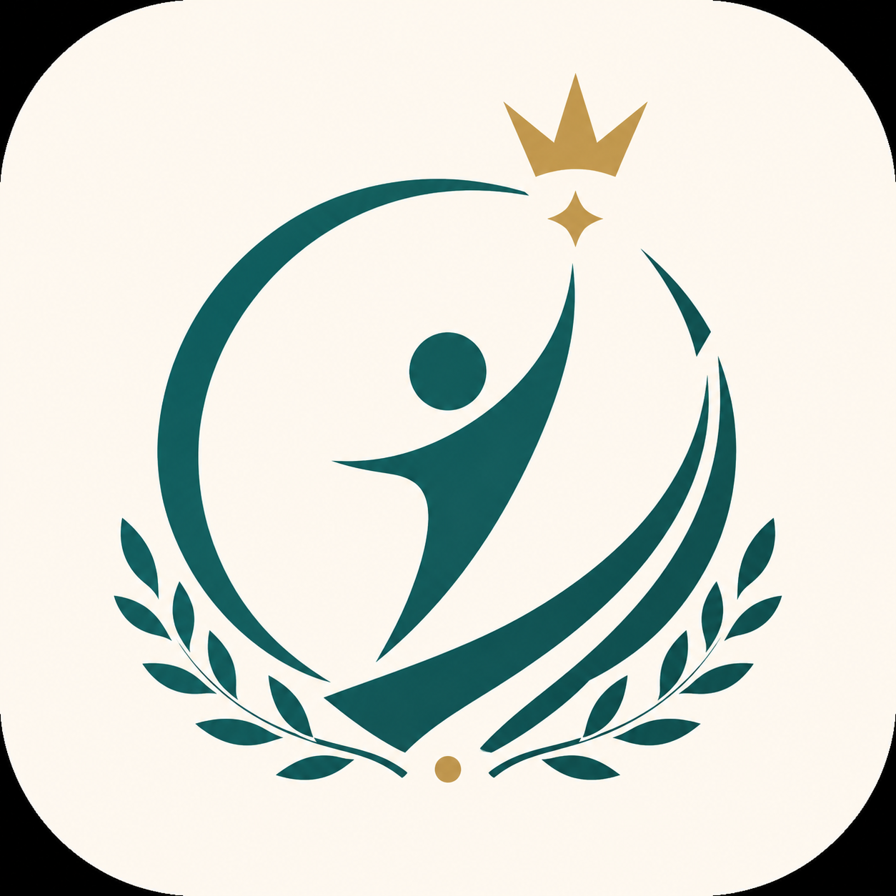

<div align="center">



# 赛点 Match Point

**面向技能比赛训练的离线计时 · 标记 · 评分 · 复盘工具**

<br />

<a href="#"></a> <a href="#"></a> <a href="#"></a> <a href="#"></a>

<br />

<a href="README_EN.md">English</a>

<br />

<p>
  <a href="#-功能亮点">功能亮点</a> ·
  <a href="#-快速开始">快速开始</a> ·
  <a href="#-项目结构">项目结构</a> ·
  <a href="#-数据说明">数据说明</a> ·
  <a href="#-常见问题">常见问题</a>
</p>

</div>

---

## 这是什么

赛前训练，选手需要反复模拟比赛流程、控制时间节奏、记录问题节点、复盘改进方向。

传统做法：**手计时 + 纸质记录** → 效率低、数据散、复盘靠回忆。

赛点的做法：**把训练全流程数字化，全程离线，数据只在本地。**

> 选模板 → 计时训练 → 快捷标记 → 任务清单 → 自评打分 → 生成报告 → 导出分享

一个 App 搞定整个训练闭环，不联网、不登录、不上传。

---

## 功能亮点

### 模板系统

4 套内置模板 + 自定义模板，覆盖常见训练场景：

| 模板 | 时长 | 目标 | 阶段 | 场景 |
|:-----|:----:|:----:|:----:|:-----|
| 60 分钟技能比赛训练 | 60 min | 55 min | 6 | 完整比赛模拟 |
| 55 分钟冲刺训练 | 55 min | 50 min | 4 | 压缩版训练 |
| 项目答辩训练 | 20 min | 18 min | 4 | 答辩场景 |
| 设备调试训练 | 45 min | 40 min | 5 | 技术调试 |

自定义模板支持：名称、总时长、目标时间、阶段名称与分钟数。

### 训练计时

- **阶段计时** — 按预设阶段自动切换，支持手动前进 / 回退
- **双进度条** — 总进度 + 当前阶段进度，一目了然
- **超时提醒** — 达到目标时间提示收尾，超时红色警告
- **全屏模式** — 大字显示剩余时间，适合投屏 / 远距离查看
- **后台保持** — 切出 App 继续计时，返回自动补算离开时间
- **草稿恢复** — 未完成训练自动保存，下次打开恢复进度

### 快捷标记

训练中一键记录关键节点，不用暂停、不用拿笔：

| 标记类型 | 用途 |
|:---------|:-----|
| 讲解开始 / 结束 | 记录讲解环节耗时 |
| 演示开始 / 结束 | 记录演示环节耗时 |
| 设备异常 | 标记出问题的节点 |
| 表达卡顿 | 标记表达不顺的时刻 |
| 超时风险 | 提前标记可能超时的节点 |

支持自定义标记类型 + 备注说明。

### 评分与复盘

- **7 项自评指标** — 时间控制 · 技术说明 · 系统演示 · 操作规范 · 表达流畅 · 现场稳定 · 创新展示
- 每项支持**选择扣分原因**，精确定位薄弱环节
- 自动生成**复盘报告**（标记分析 · 阶段偏差 · 改进建议）
- 报告可导出为**图片**保存到相册，或**复制文本**直接分享

### 统计分析

自动汇总所有训练数据，帮你发现规律：

- 累计训练次数 / 平均分 / 最高分
- 超时次数与最常超时阶段
- 最常见标记类型（高频问题）
- 最常见扣分原因（薄弱环节）

### 赛前检查

5 大类 · 29 项检查清单，覆盖：

> 设备检查 · 材料检查 · 程序检查 · 演示检查 · 备用方案

逐项打勾，进度可视化，防临场遗漏。状态自动保存，可分多次完成。

---

## 快速开始

### 环境要求

| 依赖 | 版本 |
|:-----|:-----|
| HBuilderX | 3.0+ |
| Node.js | 16+（如需 npm 依赖） |
| Android SDK | 打包 APK 时需要 |

### 开发运行

```bash
# 1. 克隆项目
git clone <repo-url>
cd app/

# 2. 用 HBuilderX 打开 app/ 目录

# 3. 运行 → 运行到手机或模拟器（Android）
```

### 打包发布

```
HBuilderX → 发行 → 原生App-云打包 → 选择 Android → 生成 APK
```

- 目标 SDK：Android API 34
- 所需权限：`VIBRATE` · `WAKE_LOCK` · `READ/WRITE_EXTERNAL_STORAGE`

---

## 项目结构

```
app/
├── manifest.json              # 应用配置（AppID、权限、版本、图标）
├── pages.json                 # 页面路由与 TabBar 配置
├── main.js                    # 入口文件
├── App.vue                    # 根组件
│
├── pages/
│   ├── index/                 # 首页 — 统计概览、最近训练、口号轮播
│   ├── template/              # 模板 — 列表 + 编辑器
│   ├── training/              # 训练 — 计时、全屏、清单、评分、报告
│   ├── history/               # 记录 — 训练历史列表 + 详情
│   ├── statistics/            # 统计 — 聚合分析
│   ├── tools/                 # 工具 — 时间计算、赛前检查、数据备份
│   └── check/                 # 赛前检查 — 5 类 29 项清单
│
├── utils/
│   ├── storage.js             # 本地存储 CRUD
│   ├── report.js              # 报告生成（评分、偏差、标记分析）
│   ├── time.js                # 时间工具（格式化、计算、转换）
│   └── export.js              # 导出（Canvas 图片生成、文本导出）
│
├── styles/
│   ├── theme.scss             # 主题变量（配色、圆角、阴影）
│   └── common.scss            # 全局通用样式
│
├── data/
│   └── slogans.json           # 首页口号（65 条中英双语）
│
└── static/                    # 静态资源（图标、TabBar 图片）
```

---

## 数据说明

**全部数据存储在本地**，不联网、不上传、不登录。

| 存储键 | 内容 |
|:-------|:-----|
| `skill_training_templates` | 训练模板（内置 + 自定义） |
| `skill_training_records` | 训练记录（计时、评分、标记、报告） |
| `skill_current_training` | 当前进行中的训练草稿 |
| `MATCH_POINT_PRECHECK` | 赛前检查状态 |
| `MATCH_POINT_SETTINGS` | 应用设置 |

> 卸载 App 会清除所有数据。建议定期使用「数据备份」功能导出 JSON 文件。

支持**导出备份** / **导入恢复**，清空数据前会二次确认。

---

## 设计系统

| 令牌 | 色值 | 用途 |
|:-----|:-----|:-----|
| Primary | `#0F5C5C` 深青 | 标题、主要操作 |
| Accent | `#C99A2E` 金色 | 强调、高亮 |
| Background | `#F7F4EA` 暖白 | 页面背景 |

Material 3 风格，统一圆角 / 阴影 / 间距，详见 `styles/theme.scss`。

---

## 常见问题

<details>
<summary><b>切出 App 后计时会停吗？</b></summary>
<br />
不会。后台保持计时，返回时自动补算离开期间的时间。
</details>

<details>
<summary><b>训练到一半退出了怎么办？</b></summary>
<br />
自动保存为草稿，下次打开同一模板时会提示恢复进度。
</details>

<details>
<summary><b>数据会丢失吗？</b></summary>
<br />
数据存在本地 Storage 中，卸载 App 会清除。建议定期使用「数据备份」功能导出 JSON。
</details>

<details>
<summary><b>全屏模式和普通模式有什么区别？</b></summary>
<br />
全屏模式大字显示剩余时间和当前阶段，适合投屏或远距离查看。两个模式共享同一份训练数据，可自由切换。
</details>

<details>
<summary><b>报告图片导出失败？</b></summary>
<br />
部分安卓设备需要手动授权相册权限。如果保存失败，可使用「复制报告文本」功能作为替代。
</details>

---

<div align="center">

**赛点** · 面向技能比赛训练的离线复盘工具

</div>
