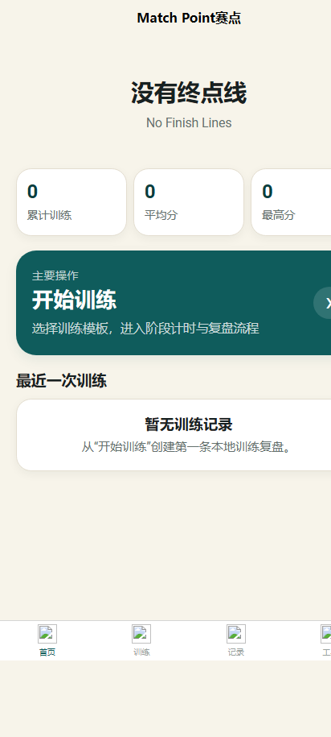

<div align="center">


# Match Point

**An offline-first timer, marker, scoring, and review tool for skills-competition practice.**

[](https://github.com/owdf/match-point/actions/workflows/ci.yml)
[](https://owdf.github.io/match-point/)
[](https://github.com/owdf/match-point/releases/latest)
[](LICENSE)

[Use the live app](https://owdf.github.io/match-point/) · [中文](README.md) · [Report a bug](https://github.com/owdf/match-point/issues/new)

</div>



## Why Match Point exists

Competition practice is more than a countdown. A trainee must control the pace of each stage, mark presentation or equipment problems, complete a pre-flight checklist, score the attempt, and decide what to improve next.

Match Point keeps that workflow together:

> Choose a template → time the session → add markers → check tasks → score → review → back up

No account is required. The project code does not call an AI service or application backend. The hosted app needs a network connection on its first load; after its assets are cached, it can run offline as an installed PWA. Training data stays in the current browser or app's local storage.

## Start using it

### Install the PWA

1. Open the [live Match Point app](https://owdf.github.io/match-point/) in Chrome, Edge, or an Android browser.
2. Use the install button in the address bar or **Add to Home screen** in the browser menu.
3. Open the complete app once; it can then start offline.

The PWA is the recommended distribution: no account, no APK, and it works on phones and desktops.

### Download the static package

[GitHub Releases](https://github.com/owdf/match-point/releases/latest) provides `MatchPoint-PWA.zip` and `SHA256SUMS.txt`. Serve the extracted files over HTTP because Service Workers do not run from `file://`:

```powershell
npx serve .
```

### Native Android status

The repository retains its uni-app Android configuration and complete native icon set, so maintainers can build it with HBuilderX. The project does not currently label an unsigned or disposable-key build as a production APK. Reliable Android updates require a long-lived private signing key. Install the PWA unless you are building the native app yourself.

## Features

- Four built-in templates plus custom durations, targets, and stages.
- Millisecond total and stage timers with pause, navigation, fullscreen mode, and elapsed-time recovery.
- Quick markers for explanations, demonstrations, equipment faults, speech stalls, and overtime risk.
- Automatic draft persistence and recovery.
- Task checklist, seven scoring categories, and deduction reasons.
- Analysis of marker intervals, stage deviation, recurring low scores, and overtime stages.
- Text and image review reports.
- A 29-item pre-competition checklist across five categories.
- JSON backup, restore, and local-data reset.
- No account, cloud database, or analytics configuration.

## Data and privacy

Templates, records, drafts, checklist state, and settings are stored locally. Clearing site data, clearing browser storage, or uninstalling the app deletes them. Export a JSON backup from **Tools → Data backup** before changing devices or clearing data.

Import replaces the complete local dataset, including any current draft. Version 1.4.0 also clamps invalid negative durations and out-of-range scores and repairs empty stage lists before they can corrupt reports or statistics.

## Development

Node.js 22 or newer is required.

```powershell
git clone https://github.com/owdf/match-point.git
cd match-point
npm ci
npm run dev:h5
```

Verify and build:

```powershell
npm test
npm run build:h5
npm run verify:build
```

The output is written to `dist/build/h5`. The build verifier requires the entry page, Web App Manifest, Service Worker, and install metadata to exist.

Generate the exact native icon sizes from the source logo with:

```powershell
.\scripts\generate-icons.ps1
```

## Project layout

```text
pages/                      UI and training flow
utils/storage.js            Local data, backup, and statistics
utils/report.js             Stage, marker, and review analysis
utils/time.js               Time conversion and formatting
utils/export.js             Text and image report export
public/                     PWA manifest and Service Worker
test/                       Node.js unit and regression tests
unpackage/res/icons/        Complete native icon sizes
.github/workflows/          CI, Pages deployment, and releases
```

## Known limitations

- There is no automatic cross-device sync; transfer JSON backups manually.
- Incognito mode and clearing site data remove local records.
- Browser background scheduling is limited; Match Point recalculates elapsed time from timestamps when it returns to the foreground.
- Image export depends on platform support; plain-text copy remains available.
- A production Android APK is not published until the maintainer supplies a long-lived private signing key.

## Contributing and license

Run `npm run check` before submitting a change. Bug reports should include the platform, browser or HBuilderX version, reproduction steps, and a redacted backup sample when relevant.

[MIT License](LICENSE) © 2026 Dongfang Wang.
